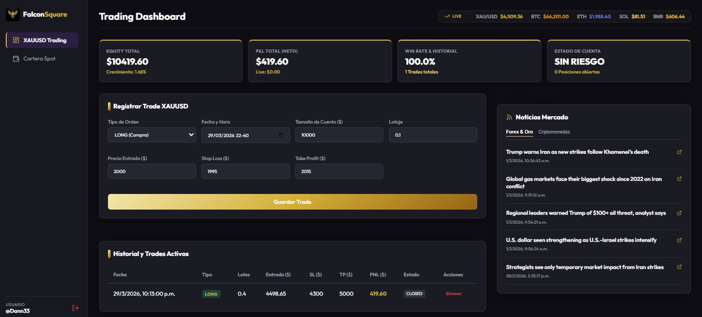

# Falcon Square Management - Trading Dashboard



**Falcon Square Management** es una plataforma de análisis y gestión de trading de alto rendimiento para activos como el Oro (XAUUSD) y criptomonedas (Portfolio Spot). Este software ha sido diseñado con una estética de lujo basada en tonos dorados y negros, ofreciendo una experiencia moderna, rápida y totalmente responsiva.

## 🚀 Características Principales

### 1. Gestión de Trading XAUUSD (Oro)

- **Registro de Operaciones**: Permite registrar entradas en Long/Short con detalles minuciosos como lotaje, tamaño de la cuenta, precio de entrada, Stop Loss y Take Profit.
- **PnL en Tiempo Real (Live)**: El sistema calcula automáticamente las ganancias o pérdidas (PnL) de los trades abiertos basándose en la cotización actual del mercado.
- **Métricas de Performance**: Visualización instantánea del Balance, Equity, Crecimiento de Cuenta y Win Rate.
- **Historial de Operaciones**: Gestión completa de trades cerrados y activos.

### 2. Cartera de Criptomonedas (Spot Portfolio)

- **Seguimiento de Activos**: Soporte para Bitcoin (BTC), Ethereum (ETH), Solana (SOL), Binance Coin (BNB) y Tether (USDT).
- **Compras con Cotización en Vivo**: Al registrar una compra en USDT, el sistema consulta el precio de mercado en tiempo real para calcular la cantidad exacta de activo adquirida.
- **Inventario Global**: Resumen del valor total de la cartera y PnL acumulado comparado con la inversión inicial.

### 3. Inteligencia de Mercado

- **Ticker de Precios**: Barra superior con cotizaciones en vivo (vía CoinGecko API) para los activos principales.
- **Widget de Noticias Dual**: Dos canales de noticias integrados: uno dedicado a Forex/Oro y otro a Criptomonedas, ambos actualizados al minuto.

### 4. Seguridad y Persistencia

- **Sistema de Login**: Acceso protegido con credenciales seguras.
- **Privacidad Local**: Todos los datos de trades y cartera se almacenan localmente en el navegador (`localStorage`), garantizando que tu información financiera nunca salga de tu dispositivo.

## 🛠️ Tecnologías Utilizadas

- **Framework**: [React 19](https://react.dev/) + [TypeScript](https://www.typescriptlang.org/)
- **Bundler**: [Vite](https://vitejs.dev/)
- **Navegación**: [React Router DOM](https://reactrouter.com/)
- **Iconografía**: [Lucide React](https://lucide.dev/)
- **Estilos**: Vanilla CSS con diseño Glassmorphism y Responsive Design.
- **APIs**: CoinGecko (Precios) e Investing/CoinJournal (RSS News).

## 💻 Instalación y Ejecución

1. **Instalar dependencias**:

   ```bash
   npm install
   ```

2. **Iniciar el servidor de desarrollo**:

   ```bash
   npm run dev
   ```

3. **Credenciales de Acceso por Defecto**:
   - **Usuario**: `Dann33`
   - **Contraseña**: `compra33`

---

Desarrollado para **Falcon Square Management** - _Precision in every trade._
